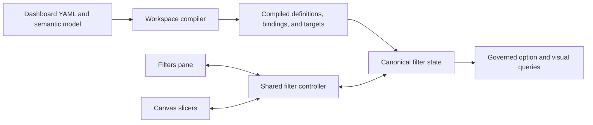

# Filter and slicer target architecture

LeapView models filtering as governed semantic state. A filter definition describes which predicates are legal, a binding gives that definition scope and targets, and one or more presentations let a reader inspect or change the same bound state. The right-side Filters pane and on-page slicers therefore share behavior without becoming the same layout object.

This design follows the useful part of the Power BI mental model: filters are scoped state, the Filters pane is a centralized editor, and slicers make selected filters prominent on the report canvas. LeapView intentionally uses a smaller, typed, deterministic contract instead of reproducing every Power BI filter category or authoring exception.

## Status and scope

This document defines the target architecture. Existing dashboard configuration continues to use the generated configuration reference until the target contract is implemented and published. Illustrative shapes in this document communicate architectural boundaries; they are not accepted configuration syntax.

The target covers:

- Semantic filter definitions and typed predicates.
- Report-, page-, and component-scoped bindings.
- Filters pane and slicer presentations.
- Canonical applied state, optional shared draft state, defaults, clear, reset, and apply.
- URL state and future saved reader views.
- Static and governed dynamic option sources.
- Target resolution, cascading options, query execution, cancellation, and stale-result protection.
- Generated server/browser contracts, accessibility, authorization, observability, and testing.

Cross-filtering and cross-highlighting from chart, map, or table selections remain interaction features. They can compose with filter bindings, but they do not become filter definitions or slicers.

## Goals

- Give the Filters pane and canvas slicers one semantic state model and one mutation protocol.
- Separate predicate meaning, scope, targeting, state, and presentation.
- Make pane-only, slicer-only, hidden, locked, and multiply presented filters explicit.
- Preserve field types from the semantic model through URLs, commands, queries, options, and browser controls.
- Compile all implicit applicability into deterministic target sets.
- Keep option loading bounded and usable for both low- and high-cardinality fields.
- Make rapid changes cancel or supersede obsolete work.
- Allow page scope first without preventing report scope, synchronized presentations, or deferred apply.
- Ensure every visible state can be explained, cleared when allowed, and reset to its authored default.

## Non-goals

- Do not clone every Power BI automatic, include/exclude, drill, drillthrough, pass-through, or transient filter category.
- Do not automatically expose every field used by a visual as an editable filter card.
- Do not make renderer configuration, DOM selectors, or component-private events part of filter semantics.
- Do not treat hidden filters as a security mechanism.
- Do not let slicers construct unrestricted semantic queries.
- Do not use canvas placement to determine whether a filter applies.
- Do not maintain independent filter implementations or state envelopes for the pane and canvas.
- Do not make cross-highlighting a filter operation.

## Terminology

| Term | Meaning |
| --- | --- |
| Filter definition | Reusable semantic predicate policy: field, value type, legal predicate shapes, defaults, option source, and URL identity. |
| Filter binding | An instance of a definition with report, page, or component scope, compiled targets, pane policy, and canonical state identity. |
| Filter state | Typed applied values for a binding plus optional pending draft values and revision metadata. |
| Filter presentation | A reader-facing editor bound to filter state, either a pane card or a canvas slicer. |
| Slicer | An on-page presentation of a filter binding. It is a page component, not a separate predicate system. |
| Filters pane | A centralized presentation of bindings exposed to the reader on the active report/page/component. |
| Option domain | The authorized, context-sensitive values available to a categorical control. |
| Clear | Replace one binding with its unfiltered identity, when the binding is editable. |
| Reset | Restore authored defaults for the requested binding, page, or report scope. |
| Apply | Atomically promote shared draft state to applied state. |

## Architectural invariants

1. A filter definition has semantic meaning but no page layout.
2. A binding establishes applicability independently of whether any presentation is visible.
3. A slicer and pane card bound to the same binding always show the same applied and pending state.
4. Presentation components emit typed mutations; they never replace the complete dashboard filter envelope.
5. The route-level filter controller is the only browser owner that merges filter mutations.
6. The server validates every binding, value, operator, target, revision, and option request.
7. The workspace compiler resolves semantic field types and produces exact compatible target sets.
8. Explicitly targeted incompatible components fail compilation; implicit scope excludes incompatible components deterministically.
9. Applied filter state, interaction selections, and spatial selections are independent roots and cannot erase one another.
10. Clear, reset, cancel, and apply have distinct operations and testable semantics.
11. URL state represents applied state only and is normalized by the server-owned contract.
12. Option queries and visual queries enforce the same authorization and data policies.
13. Every asynchronous result is bound to serving state, filter revision, and request generation.
14. Generated TypeSpec models are the wire authority for Go and TypeScript.
15. “All” means the unfiltered identity; it never means selecting only the currently loaded option page.

## Architecture overview



Deployment compilation produces immutable filter definitions, bindings, target sets, and presentation specifications. Runtime state contains only values and revisions. Browser components do not rediscover scope, infer field types, or decide which queries a filter affects.

## Authored and compiled contracts

### Filter definitions

A definition owns reusable semantic policy:

- Stable definition ID and reader-facing label/description.
- Semantic field and optional fact identity.
- Compiler-resolved value type.
- Allowed predicate variants and operators.
- Authored default expression.
- Static or governed dynamic option source.
- Stable URL parameter identity and encoding policy.
- Optional formatting metadata shared across presentations.

Predicate and presentation are separate axes. A categorical set predicate can appear as a dropdown, list, or button group. A range predicate can appear as numeric inputs, a slider, or a date picker. An input presentation can produce an equality, comparison, or string-match predicate only when the definition allows it.

The compiled predicate union is closed and typed:

```text
FilterExpression
  Unfiltered
  Set
    operator: in | not_in
    values: FilterValue[]
  Comparison
    operator: equals | not_equals | contains | not_contains |
              starts_with | ends_with | greater_than |
              greater_than_or_equal | less_than | less_than_or_equal
    value: FilterValue
  Range
    lower?: FilterBound
    upper?: FilterBound
  RelativePeriod
    direction: previous | current | next
    count: positive integer
    unit: minute | hour | day | week | month | quarter | year
    includeCurrent: boolean
```

The compiler restricts variants and operators by semantic type. For example, `contains` is valid for strings but not dates, and a relative period requires a date or timestamp.

`FilterValue` is a discriminated scalar rather than an arbitrary JSON value. Strings and booleans remain native; integers and decimals use canonical precision-safe representations; dates and timestamps use canonical ISO representations with compiled calendar and timezone semantics. Null filtering is expressed by an explicit predicate, not by overloading an empty string.

### Filter bindings

A binding owns state identity and applicability:

- Stable binding ID.
- Referenced definition ID.
- Scope: report, page, or component.
- Included or excluded page component IDs.
- Pane visibility, editability, order, and optional reader-facing label override.
- Application mode inherited from or overriding the page/report policy.
- Optional synchronization identity for deliberately shared report state.

Targets use page component IDs at the authoring boundary. The compiler resolves them to runtime consumers and records an exact target set. An omitted target list means all semantically compatible consumers within scope, not every consumer unconditionally.

A report binding can be presented by slicers on several pages without duplicating state. Each presentation keeps its own placement and visual formatting. Hiding a slicer on one page does not remove the binding or its effect.

### Presentations

Pane cards and slicers reference a binding. They may configure presentation-only behavior:

- Style: dropdown, list, buttons, input, numeric range, date range, or relative period.
- Single or multiple selection where permitted.
- Search, select-all, option counts, and summary display.
- Compact or expanded layout.
- Title, description, and accessibility text.
- Responsive arrangement and page placement for slicers.

Presentation configuration cannot broaden allowed operators, change the semantic field, override security, or alter compiled targets.

The following target shape is illustrative:

```text
filters:
  state:
    field: customers.state
    predicate: set
    default: {operator: in, values: []}
    values: {source: distinct}
    url_param: state

pages:
  - id: overview
    filter_bindings:
      state:
        filter: state
        scope: page
        targets: [revenue, orders]
        pane: {visible: true, editable: true, order: 10}
    components:
      - id: state-slicer
        kind: slicer
        filter: state
        presentation:
          style: dropdown
          selection: multiple
          search: true
        placement: {col: 1, row: 1, col_span: 3, row_span: 2}
```

The binding exists even if `state-slicer` is absent. Conversely, the pane can hide `state` while its slicer remains visible.

## Canonical state

Filter state is keyed by binding ID rather than presentation ID:

```text
DashboardFilterState
  revision
  appliedControls: binding ID -> FilterExpression
  draftControls?: binding ID -> FilterExpression
  dirtyBindings: binding ID[]
  defaultsRevision
```

Interaction selections and spatial selections remain sibling state, not optional fields copied by each filter control.

### Immediate and deferred application

Immediate mode validates and applies each completed mutation. Text input is debounced; range and date editors apply only a complete value unless the presentation has an explicit Apply action.

Deferred mode writes shared draft state. Every pane card and slicer bound to the same binding displays the draft and pending indicator. Applying promotes all dirty bindings in the selected page/report transaction to applied state and advances the filter revision once. Cancelling discards drafts without issuing visual queries.

Application mode is a page or report policy, not an accidental difference between the pane and slicers.

### Clear and reset

Clear replaces an editable binding with `Unfiltered`. Reset restores the authored default:

- Reset binding restores one binding.
- Reset page restores page bindings and page presentations.
- Reset report restores report and page defaults according to the route contract.

Locked bindings cannot be cleared or edited by readers but may be restored by an authorized authoring or administrative operation. Hidden bindings are not shown, but their applied state remains explainable through authorized diagnostics.

### URL and saved state

Initial URL parameters are parsed, typed, authorized, and normalized by the server. The server returns canonical applied state and canonical URL parameters. Browser history uses that returned representation rather than maintaining a second predicate parser.

Only applied state is shareable. Draft state, open popovers, search text, option pages, focus, and responsive layout are ephemeral.

Unknown parameters do not create filters. Invalid values produce a bounded validation result and cannot reach query planning. Stable URL parameter names are compatibility-sensitive. Future saved reader views store the same versioned applied-state contract plus dashboard and serving-definition identity.

## Browser architecture

The browser uses shared leaf controls and separate surface shells:

- Typed categorical, input, range, date, and relative-period controls own accessible input behavior.
- A pane-card shell owns grouping, scope labels, lock/visibility affordances, clear/reset actions, and expanded layout.
- A slicer shell owns page placement, compact/expanded canvas presentation, title, and responsive behavior.
- The route-level controller owns state merging, draft coordination, optimistic revisions, URL updates, and command dispatch.

A leaf control emits a mutation such as:

```text
FilterMutation
  bindingID
  baseRevision
  operation
  expression?
```

It does not emit the whole `DashboardFilters` object. The controller applies the mutation to one typed state root, preserving selections, spatial selections, and unrelated controls. The server returns canonical state; rejected or superseded optimistic state reconciles to it.

The TypeSpec signal contract generates the filter definition, binding, presentation, state, option page, mutation, validation, and status models used by Go and TypeScript. Handwritten structural duplicates are forbidden by tests.

## Compilation and validation

The workspace compiler:

1. Resolves each definition field against the semantic model.
2. Derives value type, nullability, formatting, timezone, and calendar semantics.
3. Validates predicate variants, operators, defaults, and static options.
4. Resolves each binding scope and page/component identity.
5. Computes compatible runtime targets and validates explicit targets.
6. Validates presentation style against predicate and value type.
7. Checks binding, presentation, URL parameter, and synchronization identities for collisions.
8. Validates locked/hidden/default combinations and application policies.
9. Produces deterministic compiled definitions, bindings, target sets, and revisions.

The same normalized resource graph produces byte-equivalent compiled filter content and the same revision digest.

## Runtime query behavior

### Applying filters

The server accepts a typed mutation with dashboard, page, binding, and base revision. It authorizes the route, verifies that the binding is editable, validates the expression, rejects stale or incompatible state, and computes the next canonical revision.

Each affected visual query receives the conjunction of applicable report, page, and component bindings plus targeted interaction selections and spatial selections. Within a set expression, values are disjunctive. The query planner preserves predicate grouping explicitly rather than relying on SQL precedence.

A binding does not apply to its slicer as a visual target. Its state influences the slicer's option domain through the separate option-query rules.

### Option domains

Static options are compiled into serving state. Dynamic options use a governed endpoint or command with:

- Binding ID.
- Search text.
- Opaque page cursor and bounded limit.
- Applied filter revision.
- Serving-state identity.

By default, an option query applies all active bindings that can govern the option field except the binding being populated. This lets slicers constrain one another without causing a selected value to disappear solely because it filters itself. Selected values are resolved and returned even when they fall outside the current page or search result, with availability metadata when another filter excludes them.

Option results contain typed values, display labels, optional counts, completeness, and continuation state. Client search never pretends that a bounded first page is the complete domain. High-cardinality fields require server search or a more appropriate input control.

Data policies and principal authorization apply before distinct values or counts are returned. Option caches are partitioned by serving state, principal/data-policy identity, binding, normalized context excluding self, search, and page cursor.

### Concurrency and supersession

Every mutation advances or proposes a filter revision. Query work is keyed by dashboard page, serving state, filter revision, target, and window state. A newer revision cancels or supersedes older option and visual work. Late results cannot patch a newer revision.

Deferred apply coalesces several edits into one revision. Immediate mode may debounce text input and coalesce target queries, but it cannot reorder accepted state. Status signals distinguish pending validation, pending apply, querying, partial completion, error, and settled state.

## Scope and synchronization

Page scope is the first implementation target:

- Page bindings survive regardless of pane or slicer presence.
- Their URL state belongs to that page route.
- Their targets are components on that page.

Report bindings extend the same model:

- State persists across report page navigation.
- A report binding affects compatible components on all included pages.
- Any page may show zero or more presentations of that binding.

Component scope is an explicit binding whose compiled target set contains one or more selected components. It does not depend on whichever visual currently has browser focus.

Synchronization is state identity, not event forwarding. Presentations that should remain synchronized reference the same binding. Separate bindings do not become synchronized merely because they use the same semantic field.

## Accessibility and explanation

Every presentation exposes:

- Programmatic label, description, current summary, scope, and pending/applied state.
- Keyboard operation appropriate to its control pattern.
- Visible focus and non-color selected, disabled, unavailable, and pending indicators.
- A clear action when editable and nonempty.
- Validation and query errors associated with the control.

The product can explain which bindings and interaction selections affect a visual because the compiler owns target sets and runtime state owns applied expressions. Explanations use reader-facing labels and summaries without exposing concealed policy details.

Canvas source order remains keyboard order. Responsive slicers can change layout but not semantic order or control identity.

## Security and privacy

Filters narrow authorized data; they never grant access. Workspace authorization and data policies are evaluated independently of reader filter state.

- Hidden bindings are presentation policy, not row-level security.
- Option queries cannot reveal values or counts excluded by data policy.
- URL parameters cannot reference undeclared fields, operators, targets, or bindings.
- Locked filters are enforced on the server.
- Audit records identify normalized binding IDs and operators while applying existing safe-value redaction rules.
- Public and embedded dashboards use the same compiled binding rules with surface-specific visibility and persistence policy.

## Observability

Filter operations record:

- Dashboard, page, binding, operation, and application mode.
- Base and resulting filter revision.
- Affected target count.
- Option versus visual query counts.
- Cache/coalescing outcome, queue time, execution time, cancellation, and supersession.
- Validation or authorization failure category without unsafe values.

This allows operators to distinguish slow option domains, excessive immediate-mode refreshes, expensive target fan-out, and stale-result suppression.

## Power BI prior art and deliberate differences

Power BI provides useful prior art for separating canvas slicers from the centralized Filters pane, supporting visual/page/report scope, synchronizing slicers across pages, configuring visual interactions, and deferring application for query reduction.

LeapView deliberately differs:

- One typed predicate and binding model replaces many origin-specific filter categories.
- Pane cards and slicers use the same controls and application policy.
- Explicit configuration and compilation replace editing-mode drag-and-drop behavior.
- Scope is never inferred from canvas placement.
- Synchronization shares binding state rather than forwarding changes between independent slicers.
- Cross-filter and cross-highlight selections remain interaction state.
- Generated contracts reject invalid combinations instead of tolerating optional property bags.

See the official Power BI documentation for [slicers](https://learn.microsoft.com/power-bi/visuals/power-bi-visualization-slicers), [filter scopes](https://learn.microsoft.com/power-bi/create-reports/power-bi-report-add-filter), and [filter-pane behavior](https://learn.microsoft.com/power-bi/create-reports/power-bi-report-filter).

## Delivery sequence

### Phase 1: Correct state ownership

- Add explicit page bindings independent of page components.
- Generate a discriminated filter state and mutation contract.
- Make the route controller merge mutations and preserve selection/spatial roots.
- Define and test unfiltered, clear, reset, default, and revision semantics.

### Phase 2: Shared presentations

- Extract shared categorical, text, and date controls.
- Render the same controls inside pane-card and slicer shells.
- Add dropdown, list, and button categorical presentations.
- Add compile-time presentation compatibility and accessibility tests.

### Phase 3: Governed option domains

- Apply other active bindings while excluding self.
- Add typed values, server search, pagination, selected-value resolution, and cache partitioning.
- Add request generations, cancellation, and stale-option rejection.

### Phase 4: Rich predicates and application

- Add numeric ranges, comparison inputs, and relative date/time periods.
- Add shared deferred draft state and atomic Apply/Cancel.
- Add query fan-out metrics and adaptive guidance for expensive immediate mode.

### Phase 5: Wider scope and persistence

- Add report and component scope.
- Add cross-page presentations of report bindings.
- Add versioned saved reader views and explicit persistence policy.
- Add authorized “filters affecting this visual” explanations.

## Required tests

Contract and compiler tests must prove:

- Pane-only and slicer-only bindings compile and apply.
- Multiple presentations of one binding cannot diverge.
- Invalid predicate/type/presentation combinations fail.
- Explicit incompatible targets fail and implicit targets compile deterministically.
- URL parsing and serialization round-trip typed applied state.
- Clear differs from reset when the authored default is filtered.

Runtime tests must prove:

- Filter mutation preserves interaction and spatial selections.
- Target queries receive exactly the applicable binding expressions.
- Option queries apply other bindings, exclude self, retain selected values, enforce policies, and paginate.
- Deferred Apply advances one revision and executes each affected consumer once.
- Cancelled, stale, or superseded visual and option results cannot replace newer state.

Browser tests must prove:

- Pane and slicer controls render and mutate the same state.
- Keyboard, focus, labels, summaries, errors, locked state, and pending state are accessible.
- Responsive presentation does not change state identity or keyboard order.
- Browser history reflects canonical applied state, never drafts.
- Disconnecting a presentation disposes observers without deleting bound state.

These tests are architectural gates, not optional component coverage. A new filter or slicer variant is complete only when compiler, runtime, generated contract, pane, canvas, URL, authorization, and supersession behavior agree.
