# UI Release-Readiness Report: LibreDash

| Field | Value |
|-------|-------|
| **Date** | 2026-07-18 |
| **App URL** | http://localhost:8155 |
| **Session** | libredash-release-pass |
| **Scope** | Full app: primary routes, core interactions, responsive behavior, console health, accessibility signals |

## Summary

| Status | Count |
|--------|-------|
| Original findings | 8 |
| Resolved | 8 |
| Remaining | 0 |

## Release recommendation

**Proceed with the release from a UI-readiness perspective.** All eight findings from the initial pass are resolved, covered by focused DOM/route/repository tests, and verified in the running application at desktop and mobile sizes. No JavaScript console errors were observed during either pass.

The implementation preserves the intended rendering boundary: gomponents owns the structural document and Lit owns product UI. See [Target UI Architecture](target-ui-architecture.md) for the route contract, component ownership model, responsive report layout, and remaining long-term consolidation work.

## Resolution verification

| Finding | Resolution | Verification |
|---------|------------|--------------|
| ISSUE-001 | Catalog page counts now use singular and plural forms correctly. | DOM test and [mobile catalog](screenshots/implementation-mobile-nav.png) |
| ISSUE-002 | A first accepted turn transitions from `/chats/new` to its canonical `/chats/{conversation}` route and renders the conversation. | DOM test and [first-turn result](screenshots/implementation-chat-first-turn.png) |
| ISSUE-003 | Chats are principal-scoped and global. Conversations are visible across workspace contexts, `list_workspaces` returns the principal's accessible set, and workspace-specific tools re-authorize the selected workspace on every call. | Repository/tool tests and [global workspace result](screenshots/implementation-chat-global-workspaces.png) |
| ISSUE-004 | The asset document is the single vertical scroll owner, so all detail sections remain reachable. | DOM test and [scrolled asset detail](screenshots/implementation-asset-detail-scroll.png) |
| ISSUE-005 | The authored dashboard grid and KPI sizing now preserve values, units, and supporting text. | Responsive DOM test and [desktop dashboard](screenshots/implementation-dashboard-1440.png) |
| ISSUE-006 | Desktop defaults to fit-width with an internally scrollable report surface; authored content bounds include visuals beyond a stale declared canvas height. | DOM test and [reachable Orders table](screenshots/implementation-dashboard-table-1440.png) |
| ISSUE-007 | The mobile drawer exposes one named close control; the backdrop and inert trigger are removed from the accessibility tree. | DOM test and [mobile navigation](screenshots/implementation-mobile-nav.png) |
| ISSUE-008 | Mobile uses an unscaled responsive reading order with readable KPI/chart heights and a bounded table frame. | Responsive DOM test and [390 px dashboard](screenshots/implementation-dashboard-390.png) |

## Coverage

- Dashboard catalog at desktop and 390×844 mobile viewport
- Mobile primary-navigation drawer and accessibility tree
- Chat history, new-chat submission, persisted conversations, and agent tool responses
- Workspace catalog, Sales workspace asset list, type filters, and dashboard asset details
- Data Explorer initial table and generated-SQL panel
- Connections list and scrolling behavior
- Admin General and Agent/tool inventory
- Executive Sales dashboard at 1280×576, 1440×900, and 390×844; filters and zoom behavior
- Visual Showcase overview plus Line, Map, and Tables pages
- Console and browser error checks on each sampled route; no JavaScript exceptions were observed

## Issues

### ISSUE-001: Singular dashboard page count is rendered as “1 pages”

| Field | Value |
|-------|-------|
| **Severity** | low |
| **Category** | content |
| **URL** | http://localhost:8155/ |
| **Repro Video** | N/A |

**Description**

Both single-page dashboard cards render “1 pages”. The catalog should pluralize the unit and display “1 page”; the current copy makes the release surface feel unfinished.

**Repro Steps**

1. Navigate to the dashboard catalog and observe the footer of either the Fulfillment Operations or Executive Sales card.
   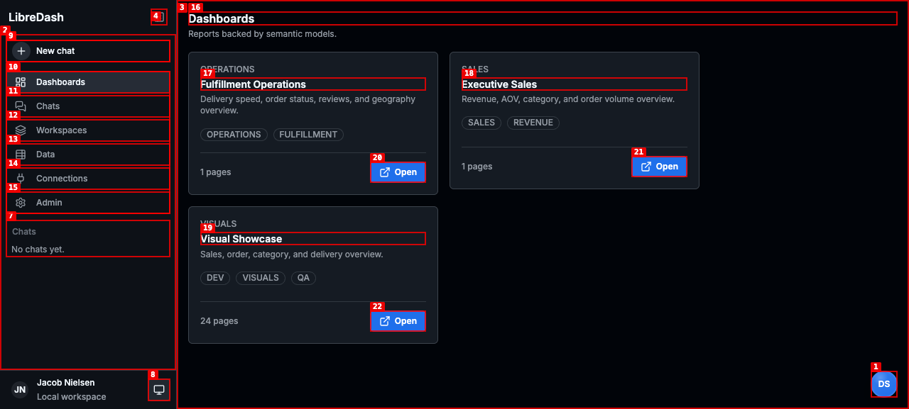

---

### ISSUE-008: Dashboard canvas is unusably scaled on mobile

| Field | Value |
|-------|-------|
| **Severity** | high |
| **Category** | responsive / visual / accessibility |
| **URL** | http://localhost:8155/workspaces/sales/dashboards/executive-sales/pages/overview |
| **Repro Video** | N/A |

**Description**

At a 390×844 viewport, Executive Sales auto-fits to 27% and renders the desktop report canvas as a miniature poster. Filter labels, KPI values, chart axes, and table rows are too small to read or tap reliably. The page rail also consumes a large block above the report despite containing only one page. The mobile shell needs a responsive report mode (stacked visuals/cards and deliberate horizontal table handling), not uniform scaling of the desktop canvas.

**Repro Steps**

1. Open Executive Sales at a 390×844 viewport.
   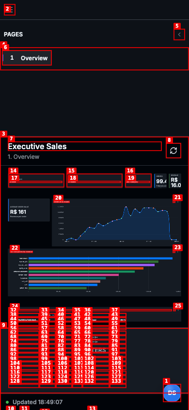

2. **Observe:** the default zoom is 27% and every core report control and value is rendered at an unusable size.

---

### ISSUE-007: Mobile navigation exposes three identical close controls

| Field | Value |
|-------|-------|
| **Severity** | medium |
| **Category** | accessibility / ux |
| **URL** | http://localhost:8155/ |
| **Repro Video** | [issue-007-repro.webm](videos/issue-007-repro.webm) |

**Description**

Opening the navigation at a 390×844 viewport adds three separate buttons named “Close navigation” to the accessibility tree: the original menu trigger, the backdrop, and the visible drawer close button. Screen-reader and keyboard users encounter multiple indistinguishable close actions, including controls that are not visually presented as buttons. The modal drawer should expose one clearly named close control and treat its backdrop as non-interactive presentation (or provide a distinct accessible name without an extra tab stop).

**Repro Steps**

1. Open the dashboard catalog at 390×844; one “Open navigation” control is present.
   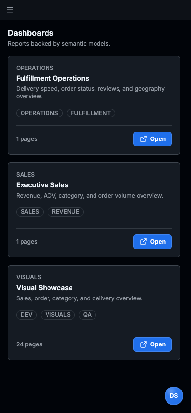

2. Open navigation.

3. **Observe:** the accessibility snapshot and annotations expose three identically named “Close navigation” buttons.
   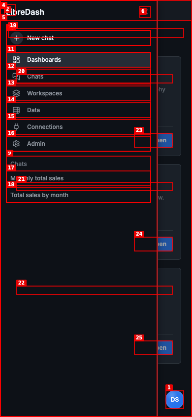

---

### ISSUE-006: “Fit page” hides the Orders table outside the non-scrollable canvas

| Field | Value |
|-------|-------|
| **Severity** | medium |
| **Category** | visual / ux |
| **URL** | http://localhost:8155/workspaces/sales/dashboards/executive-sales/pages/overview |
| **Repro Video** | N/A |

**Description**

At a 1440×900 viewport, the default Fit Page state selects 85% zoom but the report’s Orders table is entirely below the visible canvas. Scrolling does not move the report surface. The table becomes visible only after manually zooming out to approximately 45%, at which point chart labels and table content are too small for comfortable reading. “Fit page” should fit the full authored page or the canvas should provide a clear vertical navigation path.

**Repro Steps**

1. Open Executive Sales in the default 85% Fit Page state; only filters, KPIs, and two charts are visible, and scrolling does not reveal the Orders table.
   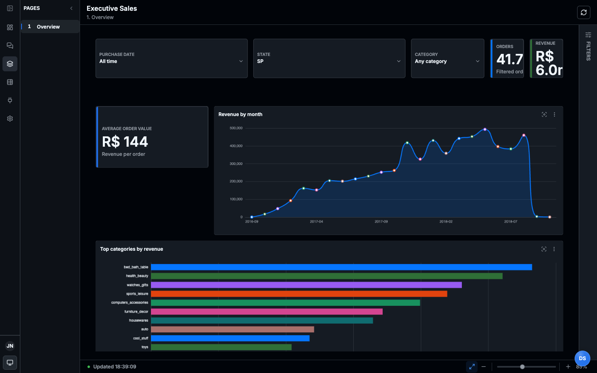

2. Zoom out four steps to approximately 45%.
   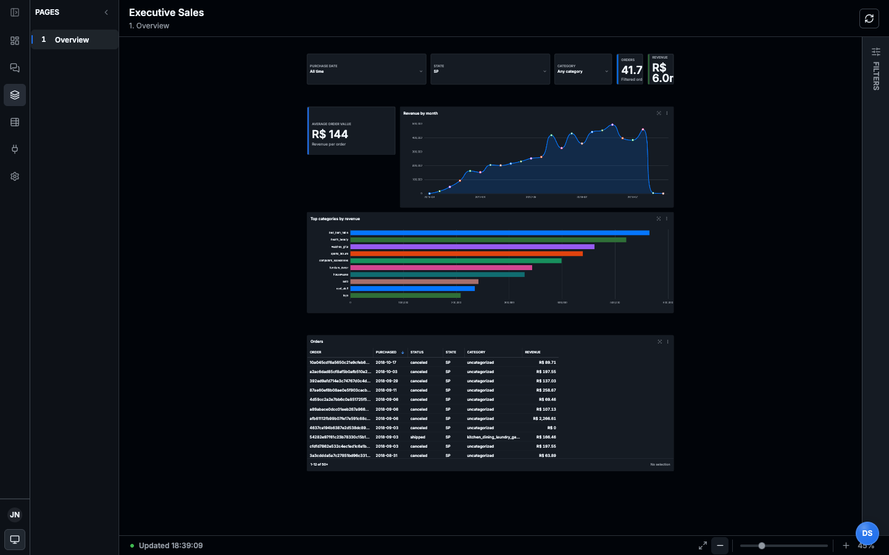

3. **Observe:** the Orders table appears only at the much smaller, unreadable zoom level.

---

### ISSUE-005: Executive Sales KPI cards clip their primary values

| Field | Value |
|-------|-------|
| **Severity** | high |
| **Category** | visual / functional |
| **URL** | http://localhost:8155/workspaces/sales/dashboards/executive-sales/pages/overview |
| **Repro Video** | N/A |

**Description**

At a 1440×900 desktop viewport with the report in its default Fit Page mode, the Orders and Revenue KPI cards are narrower than their content. “99.4k” is visually truncated to “99.4”, “R$ 16.0m” loses its unit, and both supporting labels are clipped. Average Order Value is also displaced onto a separate row with a large empty gap. These are core executive metrics; removing their magnitude suffixes changes the apparent values and makes the dashboard unsafe to read at a glance.

**Repro Steps**

1. Open Executive Sales at a 1440×900 desktop viewport and leave the default Fit Page zoom active.
   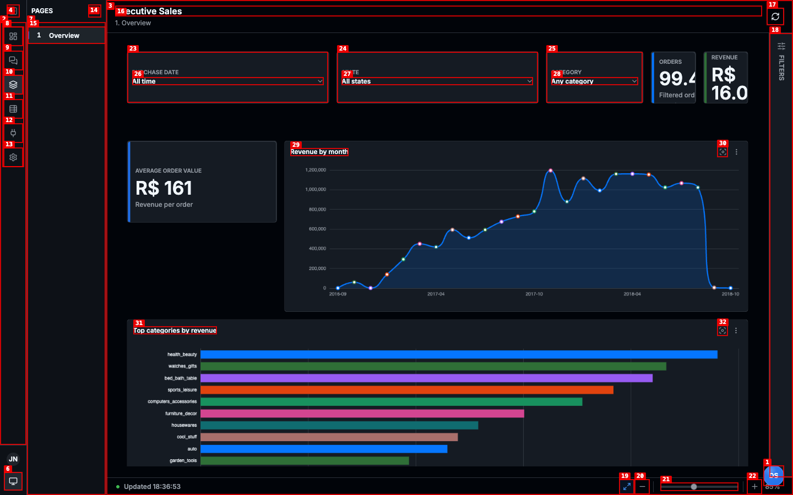

2. **Observe:** the Orders and Revenue values and supporting labels are clipped, while Average Order Value is orphaned on the next row.

---

### ISSUE-004: Scrolling an asset-detail page blanks the main content pane

| Field | Value |
|-------|-------|
| **Severity** | medium |
| **Category** | visual / functional |
| **URL** | http://localhost:8155/workspaces/sales/assets/dashboard:sales.executive-sales/details |
| **Repro Video** | [issue-004-repro.webm](videos/issue-004-repro.webm) |

**Description**

The dashboard asset-detail route contains more content than fits in the viewport, including Visuals and Tables sections. Scrolling down moves the visible content out of the main pane but does not reveal the lower sections; the pane becomes almost entirely blank while its accessibility tree still contains the data. This prevents normal visual access to the lower half of the page.

**Repro Steps**

1. Open the Executive Sales dashboard asset details; Overview, Pages, and Filters are visible and the page continues below the fold.
   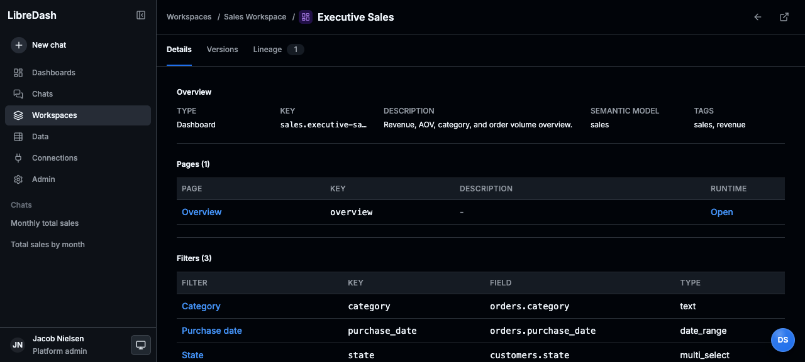

2. Scroll down approximately 300 pixels.

3. **Observe:** the main content pane becomes blank instead of revealing the Visuals and Tables sections.
   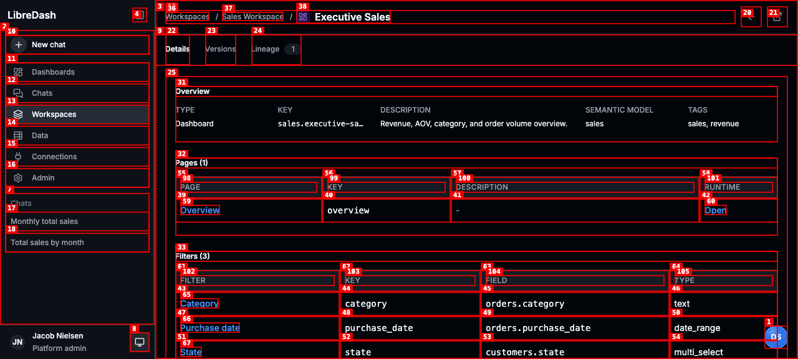

---

### ISSUE-003: Global data chat does not inherit the user's accessible workspaces

| Field | Value |
|-------|-------|
| **Severity** | high |
| **Category** | functional / ux |
| **URL** | http://localhost:8155/chat/agentconv_b3313278aa2d63bb34a2eb79 |
| **Repro Video** | [issue-003-repro.webm](videos/issue-003-repro.webm) |

**Description**

The product presents chat as a global “Ask about your data” surface, but the agent cannot list dashboards, semantic models, assets, or workspaces available to the authenticated user. It eventually claims that no workspace is configured and asks for an internal workspace ID. The Workspaces page proves that Operations, Sales, and Visuals are visible to the same user. Because chat is intentionally user-scoped and global, the turn execution context should derive the full accessible workspace and asset set from the principal's effective grants; no workspace selector or user-supplied ID should be required.

**Repro Steps**

1. Open Workspaces and observe that three deployed workspaces are available.
   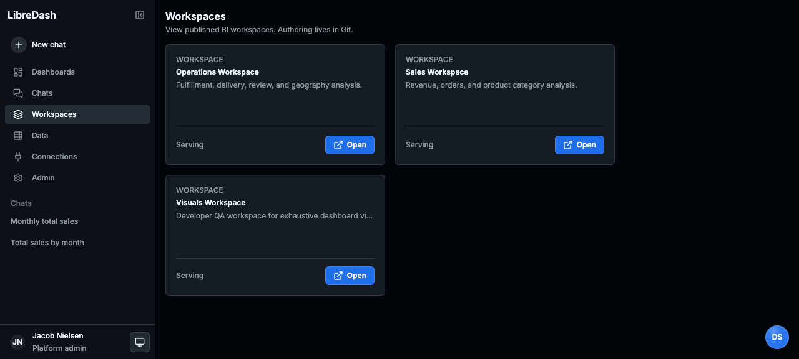

2. Open Chats and select the conversation created from a sales-data question.
   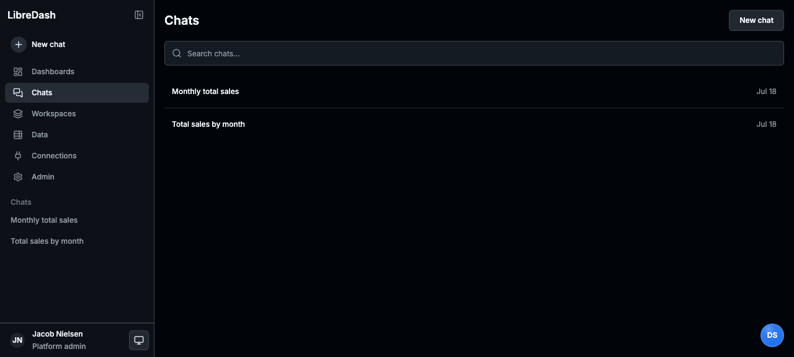

3. **Observe:** the agent reports that no workspace is available even after attempting the workspace and asset tools, rather than inheriting the workspaces already accessible to the user.
   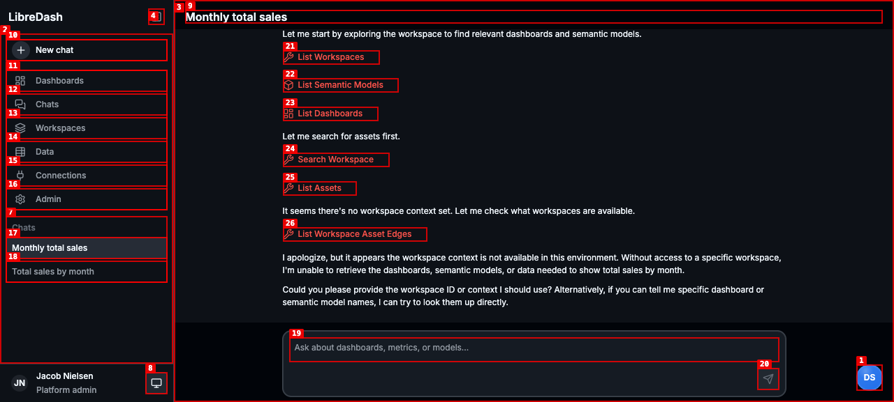

---

### ISSUE-002: New-chat submission leaves the user on an empty composer

| Field | Value |
|-------|-------|
| **Severity** | medium |
| **Category** | functional / ux |
| **URL** | http://localhost:8155/chat/new |
| **Repro Video** | [issue-002-repro.webm](videos/issue-002-repro.webm) |

**Description**

Submitting the first message creates a conversation in the sidebar, but the browser stays on `/chat/new`. After the sending state completes, the composer is blank and no user message or assistant response is rendered. The conversation is only discoverable by noticing and opening the new sidebar item. A successful first turn should transition to the canonical conversation route and show the in-progress/result state in the main pane.

**Repro Steps**

1. Navigate to `/chat/new`; the empty new-chat composer is shown.
   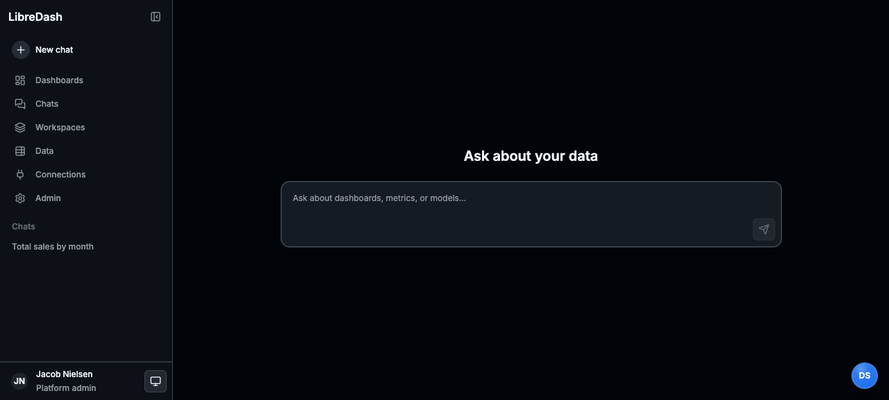

2. Enter “Show me total sales by month”.
   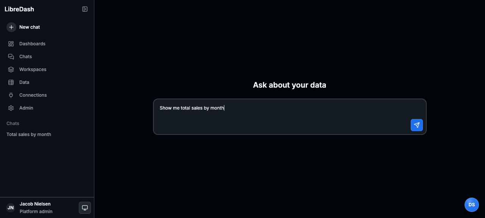

3. Submit the message; the input enters a sending state.
   

4. **Observe:** after completion, the main pane resets to the empty new-chat composer and the URL is still `/chat/new`; the created conversation is only available via the sidebar.
   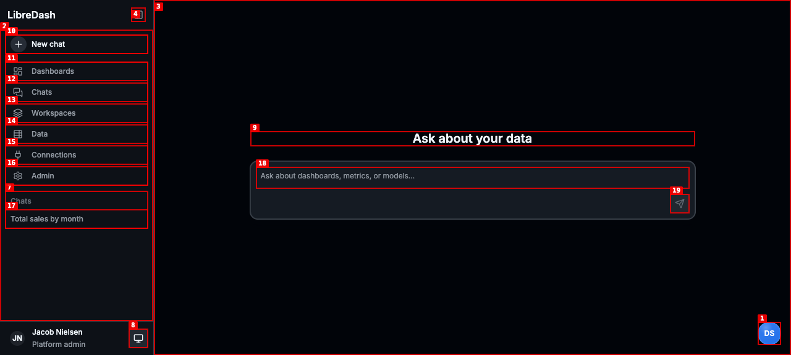

---
